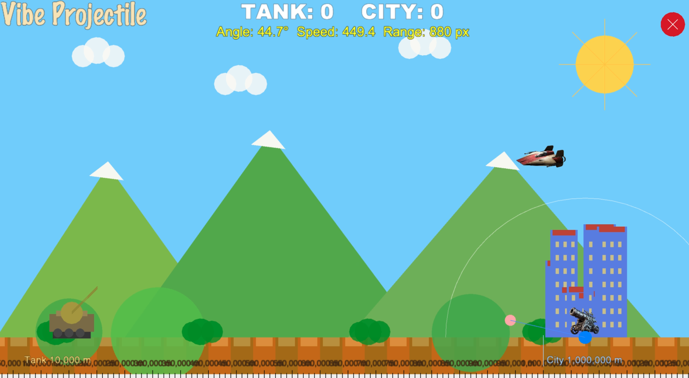

# Vibe Projectile



Vibe Projectile is a small 2D projectile simulation/game built with Pyglet. It simulates physics-based projectile launches, a moving tank, a domed city, and visual effects (explosions, spaceship attacks). The project is intended as a lightweight demo of simple game logic and projectile motion.

## Features

- Physics-based projectile firing and trajectory visualization
- City, dome, tank, and explosion visual effects
- Simple AI-controlled tank movement and randomized events
- Uses `pyglet` for rendering and `pytest` for tests

## Requirements

- Python 3.8+ (recommended)
- See `requirements.txt` for Python dependencies (`pyglet`, `pytest`)

## Setup

1. `bash setup/bootstrap.sh`
2. `bash setup/install.sh`

## Run the app

Start the app with:

```
bash run-main.sh
```

## Run tests

```
pytest -q
```

## Project structure

- `src/` — game source (main app, entities, constants, sound player)
- `media/` — images used by the app (cover and sprites)
- `setup/` — bootstrap/install scripts
- `tests/` — unit tests
- `requirements.txt` — Python dependencies

---

If you want the README text changed, shortened, or translated, tell me what tone or details to include.
